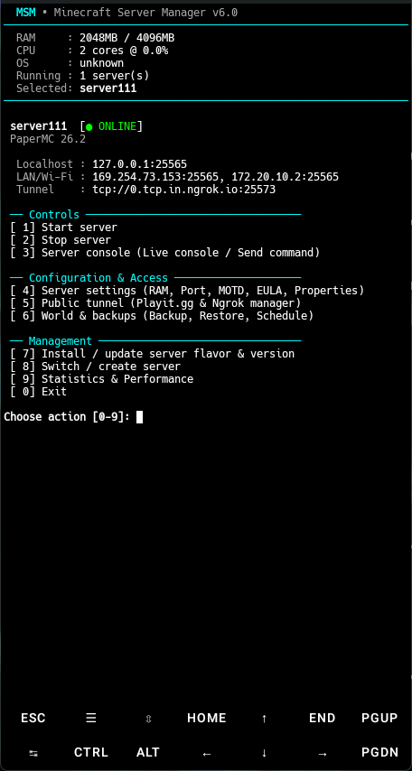

<div align="center">

# MSM — Minecraft Server Manager

**High-performance, terminal-native Minecraft server management for Termux and Linux.**  
*Multi-instance isolation • Upstream binary lifecycle • Dual tunnel bridging • SQLite telemetry*

<br/>

[](core/constants.py)
[](https://python.org)
[](https://termux.dev)
[](LICENSE)
[](https://github.com/psf/black)
[](https://flake8.pycqa.org)

<br/>



<br/>
<br/>

[Quickstart](#quickstart) •
[Architecture](#architecture) •
[Supported Flavors](#supported-server-flavors) •
[Installation](#installation) •
[CLI Reference](#cli-reference) •
[Core Systems](#core-systems) •
[Configuration](#configuration-reference) •
[Development](#development)

</div>

---

## Overview

MSM is a lightweight, zero-GUI management suite designed to deploy, operate, and supervise Minecraft server instances directly within POSIX terminal environments — from Android mobile devices running Termux to headless Linux distributions and WSL.

It orchestrates server binaries directly from upstream vendor APIs, isolates each runtime within dedicated GNU `screen` sessions, captures fine-grained system telemetry into an atomic SQLite database, manages ZIP world backups with Zip-Slip attack mitigation, and provisions public tunnel endpoints via `playit` and `ngrok`.

> [!NOTE]
> This documentation reflects the v6.0 production codebase. All described architecture, configuration fields, and behavioral characteristics correspond directly to implemented features.

---

## Architecture

```
                                +-----------------------------------+
                                |            msm.py CLI             |
                                |     (Interactive TUI Menus)       |
                                +-----------------+-----------------+
                                                  |
                                      +-----------v-----------+
                                      |    RuntimeManager     |
                                      +-----------+-----------+
                                                  |
                        +-------------------------+-------------------------+
                        |                                                   |
            +-----------v-----------+                           +-----------v-----------+
            | ServerInstance ("sv1")|                           | ServerInstance ("sv2")|
            +-----------+-----------+                           +-----------+-----------+
                        |                                                   |
      +-----------------+-----------------+               +-----------------+-----------------+
      |                 |                 |               |                 |                 |
+-----v-----+     +-----v-----+     +-----v-----+   +-----v-----+     +-----v-----+     +-----v-----+
|  screen   |     |  Monitor  |     |  Tunnel   |   |  screen   |     |  Monitor  |     |  Tunnel   |
| (mc_sv1)  |     |  Thread   |     |  Process  |   | (mc_sv2)  |     |  Thread   |     |  Process  |
| .msm.pid  |     |  (60s)    |     |(playit/   |   | .msm.pid  |     |  (60s)    |     |(playit/   |
+-----------+     +-----+-----+     | ngrok)    |   +-----------+     +-----+-----+     | ngrok)    |
                        |           +-----------+                           |           +-----------+
                        |                                                   |
                        +-------------------------+-------------------------+
                                                  |
                                      +-----------v-----------+
                                      |    DatabaseManager    |
                                      |  (SQLite in WAL Mode) |
                                      +-----------+-----------+
                                                  |
                                 +----------------v----------------+
                                 |         ~/.config/msm/          |
                                 |  - config.json (Atomic swap)    |
                                 |  - msm.db      (Metrics/Logs)   |
                                 |  - msm.log     (Rotating log)   |
                                 +---------------------------------+
```

---

## Key Features

- **Multi-Server Lifecycle**: Manage multiple independent server profiles concurrently with lazy-loaded instance controllers and zero global state collisions.
- **Direct Upstream Provisioning**: Automated build resolution and streaming downloads from PaperMC, Purpur, Folia, Mojang, Fabric, Quilt, and PocketMine-MP APIs.
- **Reliable Process Sandboxing**: Background execution via GNU `screen` (`mc_<name>`) with direct shell PID capture (`.msm.pid`) and `psutil` heartbeat validation.
- **Dual Tunnel Networking**: Native integration with `playit` (API claim exchange + daemon) and `ngrok` (TCP socket endpoint lookup) for public multiplayer without router port forwarding.
- **Automated Watchdog & Monitoring**: Independent daemon threads collect CPU/RAM metrics every 60 seconds and handle auto-restart recovery upon crash.
- **Zip-Slip Safe Backups**: DEFLATE level 6 world archives with canonical member destination verification and symlink rejection.
- **RCON with Shell Fallback**: Source RCON client protocol execution with automated fallback to `screen -X stuff` if RCON is unavailable.
- **Atomic Configuration Engine**: Deep-merge schema migrations across version updates with `.tmp` write-and-replace atomicity.

---

## Supported Server Flavors

| Flavor | Runtime | Default Port | Min RAM | Upstream Binary Source |
|---|---|---|---|---|
| **PaperMC** | Java | `25565` | 512 MB | PaperMC v2 API — versioned build artifact |
| **Purpur** | Java | `25565` | 512 MB | Purpur API — latest build stream per version |
| **Folia** | Java | `25565` | 1024 MB | PaperMC v2 API (Folia project builds) |
| **Vanilla** | Java | `25565` | 512 MB | Mojang Official Version Manifest (Release / Snapshot) |
| **Fabric** | Java | `25565` | 768 MB | FabricMC Meta — loader + server installer |
| **Quilt** | Java | `25565` | 768 MB | QuiltMC Meta — loader artifact stream |
| **PocketMine-MP** | PHP | `19132` | 256 MB | GitHub Releases — official `.phar` release |

> [!TIP]
> PaperMC, Folia, and Purpur build metadata queries are executed concurrently across worker pools (up to 8 threads, inspecting the 20 most recent upstream versions).

---

## Requirements

### Runtime Dependencies

| Component | Minimum Version | Purpose |
|---|---|---|
| **Python** | 3.10+ | Core application execution |
| **psutil** | 5.9+ | CPU/RAM telemetry sampling and PID verification |
| **requests** | 2.31+ | API communication and chunked binary streaming |
| **screen** | Any POSIX | Process session detachment and console interaction |

### Java Runtime Matrix

| Minecraft Version Range | Target Java Release | Recommended Package |
|---|---|---|
| `<= 1.16.5` | Java 8 | `openjdk-8` / Custom `java_homes.8` |
| `1.17` – `1.20.4` | Java 17 | `openjdk-17` |
| `>= 1.20.5` | Java 21 | `openjdk-21` |

---

## Installation

### Automated Install

Run the official bootstrap script to install system packages, configure runtime virtual environments, and link dependencies:

```bash
curl -fsSL https://raw.githubusercontent.com/sizwinz/MSM-minecraft-server-manager-termux/main/install.sh | bash
```

The script automatically detects package managers (`pkg` on Termux, `apt-get` on Debian/Ubuntu/WSL) and installs Java 17, Java 21, Python, `screen`, PHP, and Playit.

### Manual Setup

<details>
<summary><strong>Termux (Android)</strong></summary>

```bash
# 1. Update system repositories and install packages
pkg update && pkg upgrade -y
pkg install -y python git screen openjdk-17 openjdk-21 php python-psutil tur-repo playit

# 2. Clone repository
git clone https://github.com/sizwinz/MSM-minecraft-server-manager-termux.git
cd MSM-minecraft-server-manager-termux

# 3. Initialize virtual environment and install requirements
python -m venv --system-site-packages .venv
source .venv/bin/activate
python -m pip install --upgrade pip
python -m pip install -r requirements.txt

# 4. Launch MSM
python msm.py
```
</details>

<details>
<summary><strong>Debian / Ubuntu / WSL</strong></summary>

```bash
# 1. Install prerequisites and package repositories
sudo apt-get update
sudo apt-get install -y git screen python3 python3-pip python3-venv curl gnupg ca-certificates
sudo apt-get install -y openjdk-17-jre-headless openjdk-21-jre-headless php-cli

# 2. Add Playit repository (optional, for Playit tunnels)
curl -fsSL https://playit-cloud.github.io/ppa/key.gpg -o /tmp/playit.gpg
sudo gpg --dearmor -o /etc/apt/trusted.gpg.d/playit.gpg /tmp/playit.gpg
echo "deb [signed-by=/etc/apt/trusted.gpg.d/playit.gpg] https://playit-cloud.github.io/ppa/data ./" | sudo tee /etc/apt/sources.list.d/playit-cloud.list
sudo apt-get update
sudo apt-get install -y playit

# 3. Clone and configure MSM
git clone https://github.com/sizwinz/MSM-minecraft-server-manager-termux.git
cd MSM-minecraft-server-manager-termux

python3 -m venv .venv
source .venv/bin/activate
python -m pip install --upgrade pip
python -m pip install -r requirements.txt

# 4. Launch MSM
python msm.py
```
</details>

---

## Quickstart

```bash
# Activate virtual environment
source .venv/bin/activate

# Start the interactive management console
python msm.py
```

### Standard Workflow

```
[1] Create Server Profile   ──> Name sanitized to [a-zA-Z0-9_.-]
[2] Install Binary          ──> Select Flavor & Version (Paper, Purpur, Vanilla, etc.)
[3] Configure Parameters    ──> Set allocated RAM, port, MOTD, RCON, Tunnel
[4] Start Instance          ──> Spawns detached screen (mc_<name>) with PID lock
[5] Console / Administration──> Live console attach, send commands, trigger backups
```

---

## CLI Reference

The interactive TUI provides direct controls for all server lifecycle operations:

| Menu Option | Operation & Details |
|---|---|
| **Start server** | Synchronizes `server.properties` and `eula.txt`, launches `screen -dmS mc_<name>`, captures PID |
| **Stop server** | Issues graceful stop via RCON or `screen -X stuff`; terminates screen session on timeout |
| **Install / Update server** | Interactive version catalog picker; streams binary artifact to `~/minecraft-<name>/` |
| **Configure server** | RAM bounds, server port, MOTD, online-mode, RCON parameters, tunnel configuration |
| **Edit server.properties** | In-place key-value configuration editor with synchronization to `config.json` |
| **Edit eula.txt** | Instant EULA compliance toggle |
| **Attach to console** | Direct terminal attachment (`screen -r mc_<name>`); detach using `Ctrl+A`, then `D` |
| **World manager** | On-demand backup creation, archive listing, ZIP restoration (offline only), deletion |
| **Send command** | Executes server commands via RCON with immediate fallback to `screen -X stuff` |
| **Statistics** | Session history, cumulative uptime, crash count, 24h rolling CPU/RAM utilization curves |
| **Create new server** | Registers a new isolated server profile and provisions root directory |
| **Switch server** | Switch active context among all configured server profiles |
| **Exit** | Prompts to optionally terminate running server sessions before closing MSM |

---

## Core Systems

### Process Lifecycle & Session Sandboxing

MSM executes servers under isolated GNU `screen` sessions. To eliminate ambiguity in PID resolution, the startup command wraps execution in a subshell:

```bash
screen -dmS mc_<name> sh -c "echo $$ > .msm.pid; exec java -Xmx2048M -Xms2048M -XX:+UseG1GC -jar server.jar nogui"
```

The runtime verifies process integrity by polling `.msm.pid` up to 10 seconds (250 ms intervals) and confirming active PID status using `psutil.Process.is_running()`.

#### State Artifacts (`~/minecraft-<server>/`)

```
~/minecraft-<server>/
├── .msm.pid            # Process PID written before exec
├── .msm.session        # Active session UUID linking to SQLite
├── .msm.tunnel.pid     # Active tunnel process PID
├── .msm.ngrok.log      # ngrok runtime logs
├── .msm.playit.log     # playit agent runtime logs
└── .msm.playit.secret  # playit authentication secret
```

---

### Telemetry & Persistent Metrics

A dedicated daemon thread monitors active server instances every 60 seconds using `psutil.Process.oneshot()` for low-overhead CPU and RAM metrics:

| Metric | Cadence | Storage Target |
|---|---|---|
| **RAM Usage (%)** | 60 seconds | `performance_metrics.memory_percent` |
| **CPU Usage (%)** | 60 seconds | `performance_metrics.cpu_percent` |
| **Session Tracking** | On Start / Stop | `server_sessions` (start_time, end_time, clean_exit) |
| **Crash & Restarts** | On Event | `server_sessions.crash_count`, `restart_count` |
| **Backup Records** | On Completion | `backup_history` (filename, size_bytes, duration) |

SQLite operates in **WAL (Write-Ahead Logging)** mode with `synchronous=NORMAL` and a 30,000 ms busy timeout to prevent write contention.

---

### World Backup Engine

Backups are packaged as DEFLATE compressed ZIP archives (compression level 6) located under `~/minecraft-<server>/backups/`.

#### World Path Discovery Order:
1. `level-name` defined in `server.properties` (defaults to `world`).
2. Associated dimensions: `<level-name>`, `<level-name>_nether`, `<level-name>_the_end`.
3. Regex directory discovery: `^world(?:[_.-].+)?$` (case-insensitive).

> [!IMPORTANT]
> **Zip-Slip & Symlink Defense:** Every extracted archive path is canonicalized and validated to ensure it remains strictly within the server root directory. Symlink entries are rejected to prevent path traversal vulnerabilities. A minimum of 500 MB free disk space is required before creating backups or installing server binaries.

---

### Dual Tunnel Bridging

Expose servers to the public internet without router port forwarding or public static IPs.

#### 1. Playit.gg Integration
- Supports Minecraft Java (TCP) and Bedrock / PocketMine-MP (UDP).
- Interactive setup wizard handles secret generation (`playit claim generate`), account linking URL generation, and one-time secret persistence (`.msm.playit.secret`).
- Agent logs are parsed in real time to extract established public hostnames (`*.playit.gg`, `*.ply.gg`).

#### 2. Ngrok Integration
- Spawns `ngrok tcp <port> --log stdout`.
- Queries the local ngrok client API (`http://127.0.0.1:4040/api/tunnels`) with a 20-second timeout to extract the assigned public TCP endpoint.

---

### Java Runtime Detection

The `get_java_path()` engine automatically selects the appropriate Java binary for the installed Minecraft version using a 3-tier cascade:

```
[1] Explicit Path  ──> config.json ["java_homes"]["<version>"]
[2] System PATH    ──> "java" binary on environment PATH (matches target version)
[3] Discovery Scan ──> Scans $JAVA_HOME, /usr/lib/jvm, /usr/lib64/jvm, Termux JVM paths
```

Candidate binaries are verified by parsing output from `java -version` against the required major version.

---

## Configuration Reference

Configuration files are maintained at `~/.config/msm/config.json`. Schema migrations and missing default fields are automatically resolved via recursive deep merge on startup.

```json
{
  "current_server": "survival",

  "java_homes": {
    "17": "/usr/lib/jvm/java-17-openjdk",
    "21": "/usr/lib/jvm/java-21-openjdk"
  },

  "tunnel_defaults": {
    "provider": "ngrok",
    "binary_path": "ngrok",
    "autostart": false
  },

  "servers": {
    "survival": {
      "server_flavor": "paper",
      "server_version": "1.21.1",
      "eula_accepted": true,
      "ram_mb": 2048,
      "auto_restart": true,

      "backup_settings": {
        "enabled": true,
        "interval_hours": 6
      },

      "tunnel": {
        "enabled": false,
        "provider": "ngrok",
        "binary_path": "ngrok",
        "autostart": false,
        "playit_tunnel_id": null,
        "last_endpoint": null
      },

      "rcon": {
        "enabled": false,
        "host": "127.0.0.1",
        "port": 25575,
        "password": ""
      },

      "server_settings": {
        "motd": "survival Server",
        "port": 25565,
        "max-players": 20,
        "online-mode": "true",
        "enable-rcon": "false",
        "rcon.port": 25575
      }
    }
  }
}
```

---

## Project Layout

```
MSM-minecraft-server-manager-termux/
├── msm.py                    # Application CLI entrypoint
├── core/
│   ├── config.py             # ConfigManager with deep-merge atomic migrations
│   ├── constants.py          # Application constants, defaults, and flavor registry
│   ├── runtime.py            # RuntimeManager instance controller
│   └── server.py             # ServerInstance lifecycle, monitors, and threads
├── db/
│   └── manager.py            # DatabaseManager (WAL SQLite persistence)
├── ui/
│   ├── cli.py                # Terminal menus, wizards, and formatted tables
│   └── colors.py             # ANSI terminal color scheme
├── utils/
│   ├── archive.py            # Backup engine, world discovery, safe extraction
│   ├── logging_utils.py      # Rotating file logging and formatted console stream
│   ├── network.py            # Upstream API clients, version fetchers, binary streams
│   ├── playit_api.py         # Playit account API client and tunnel sync
│   ├── properties.py         # Java properties file parser and serializer
│   ├── rcon.py               # Source RCON protocol client implementation
│   ├── system.py             # Java detection, PID utils, and system diagnostics
│   └── tunnels.py            # Tunnel process management and endpoint parsers
└── tests/                    # Pytest test suite
```

---

## Development

### Setup Local Environment

```bash
# Create and activate virtual environment
python -m venv .venv
source .venv/bin/activate

# Upgrade pip and install all runtime + development tools
python -m pip install --upgrade pip
python -m pip install -r requirements.txt -r requirements-dev.txt
```

### Quality Assurance & Verification

Run the comprehensive CI test suite locally before submitting changes:

```bash
# 1. Lint and style checks (100-character line length limit)
python -m flake8 --jobs=1 .

# 2. Code formatting verification
python -m black --check .

# 3. Unit and regression test suite
python -m pytest

# 4. Bytecode syntax validation across all modules
python -m compileall msm.py core db ui utils tests
```

---

## License

This project is licensed under the terms of the [MIT License](LICENSE).

<div align="center">
<sub>Designed for performance and reliability across Termux and Linux environments.</sub>
</div>
